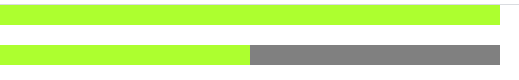

#### 定义
> width CSS属性设置一个元素的宽度。默认情况下，它设置内容区域的宽度，但是如果box-sizing设置为border-box，它将设置边界区域的宽度。 

> max-width CSS属性设置元素的最大宽度。它防止width属性的使用值大于max-width指定的值。

#### 使用

> 只有块元素（块、行内块）设置宽度才生效

```
max-width: 100px; // 支持px单位
max-width: 1em; // 支持em单位
max-width: 1ch; // 支持ch单位
max-width: 20%; // 支持%单位

width: 100px; // 支持px单位
width: 1em; // 支持em单位
width: 20%; // 支持%单位
width: auto; // 自适应
```
#### 继承机制

 块元素会默认继承父级元素的宽度，行内块的宽度取决于内部元素的宽度

```
<div style="width: 500px; height: 20px; background: gray">
      <div style="background-color: greenyellow; height: 20px"></div>
    </div>
```

 设置百分比的情况下会取父级宽度的百分比宽度作为自己的宽度
```
<div style="width: 500px; height: 20px; background: gray">
      <div style="width: 50%; background-color:  greenyellow; height: 20px;"
      ></div>
    </div>
```
结果

